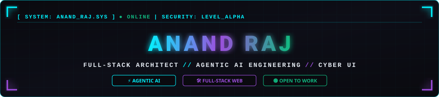
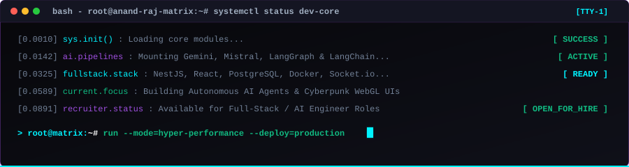
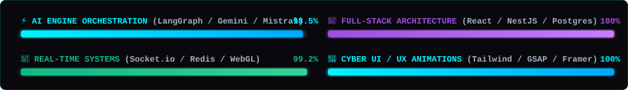

<!-- CYBERPUNK HUD HEADER BANNER -->

  

<!-- MATRIX TYPING SVG -->

  

<!-- FUTURISTIC SOCIAL HUD BADGES -->

&nbsp;

&nbsp;

&nbsp;

 

 

## ⚡ SYSTEM.INITIALIZATION // CONSOLE LOGS

 

 

## 📊 SYSTEM.DIAGNOSTICS & HUD METRICS

 

 

## 🐍 CONTRIBUTIONS.PHYSICS_MATRIX

 

 

## 📡 TELEMETRY & GITHUB STATS

<table width="100%" border="0" cellspacing="0" cellpadding="0">
  <tr>
    <td width="50%" align="center" valign="top">
      
    </td>
    <td width="50%" align="center" valign="top">
      
    </td>
  </tr>
  <tr>
    <td colspan="2" align="center" style="padding-top: 15px;">
      
    </td>
  </tr>
</table>

 

 

## 🧬 TECH.STACK // CYBER ARSENAL

### 🌐 Frontend & Animation Engine
 

  

### ⚙️ Backend & Databases
 

  

### 🧠 AI Pipelines & Orchestration
 

  

### 🛠️ DevOps, Cloud & Testing Tools
 

  

 

 

## 🚀 FEATURED.BUILDS // CYBER PRODUCTS

<table width="100%">
  <tr>
    <td width="33%" valign="top" align="center" style="background-color: #0d0e17; padding: 15px; border-radius: 8px;">
      
      
<b>GitHub Intelligence Engine</b>

      

        • Dual-AI model (Gemini + Mistral) generating code reviews & recruiter fit score. 
        • Auto README generator with custom "Roast Mode" analytics.
      

      <code>React</code> <code>Node.js</code> <code>Gemini AI</code>
        
      
    </td>
    <td width="33%" valign="top" align="center" style="background-color: #0d0e17; padding: 15px; border-radius: 8px;">
      
      
<b>Autonomous AI Content Engine</b>

      

        • 3-Agent pipeline (Inspector → Librarian → Metadata Synthesizer). 
        • Multi-agent memory, semantic vector tagging & zero-latency sync.
      

      <code>LangGraph</code> <code>Mistral</code> <code>Cohere</code>
        
      
    </td>
    <td width="33%" valign="top" align="center" style="background-color: #0d0e17; padding: 15px; border-radius: 8px;">
      
      
<b>Real-Time Multimodal Chat</b>

      

        • Multimodal vision chat with persistent history & cookie JWT auth. 
        • Socket.io duplex stream for sub-50ms message broadcast.
      

      <code>Socket.io</code> <code>LangChain</code> <code>Gemini</code>
        
      
    </td>
  </tr>
</table>

 

 

## 📜 VERIFIED.ACCREDITATIONS

&nbsp;

&nbsp;

 

<!-- ANIMATED FOOTER WAVE -->

