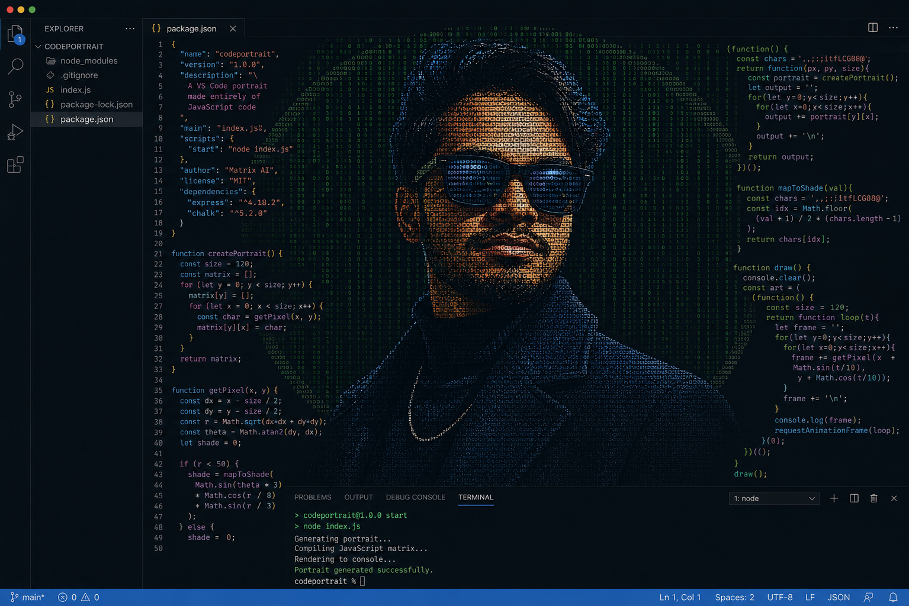

<!-- Cyber Banner Header -->

### <code>&lt; FULL-STACK JAVASCRIPT & AI ENGINEER /&gt;</code>

  
  
  

---

<!-- Dynamic Animated Typing Bar -->

 

## ⚡ SYSTEM OVERVIEW

- 👤 **Identity:** Anand Raj
- 📍 **Location:** Ranchi, India *(Open to Remote)*
- 🎓 **Education:** B.Sc Information Technology — Ranchi University *(Expected 2028)*
- 💼 **Experience:** Web Developer Intern at InAmigos Foundation | Self-Directed Full-Stack Apps
- 🎯 **Specialization:** Full Stack Web Development, Generative AI & Agentic Pipelines, Real-Time Web Apps
- 🟢 **Status:** Open to Full-Stack / Frontend Roles

 

## 🛠️ TECH MATRIX

<table>
  <tr>
    <td align="center" width="20%"><b>FRONTEND</b></td>
    <td>
      
      
      
      
      
      
    </td>
  </tr>
  <tr>
    <td align="center" width="20%"><b>BACKEND</b></td>
    <td>
      
      
      
      
      
      
    </td>
  </tr>
  <tr>
    <td align="center" width="20%"><b>AI & AGENTS</b></td>
    <td>
      
      
      
      
      
    </td>
  </tr>
  <tr>
    <td align="center" width="20%"><b>DATA & TOOLS</b></td>
    <td>
      
      
      
      
      
      
    </td>
  </tr>
</table>

 

## 🚀 FEATURED BUILDS

<table>
  <tr>
    <td width="33%" valign="top">
      <h3 align="center">🔍 RepoLens AI</h3>
      
<i>GitHub Repo Intelligence & Analysis Engine</i>

      

      <ul>
        <li>Dual-AI model architecture (Gemini + Mistral) generating interview questions and recruiter scores.</li>
        <li>Automated README generation & custom "Roast Mode" feedback.</li>
      </ul>
      

        <code>React</code> <code>Node.js</code> <code>Gemini AI</code>
      

      

        <a href="https://repolens-ai-seven.vercel.app"><b>[ Live Demo ]</b></a>
      

    </td>
    <td width="33%" valign="top">
      <h3 align="center">🧠 Recall AI</h3>
      
<i>Autonomous AI Content Organizer</i>

      

      <ul>
        <li>Built in an 8-hour sprint using a 3-agent orchestration pipeline (Inspector → Librarian → Metadata).</li>
        <li>Real-time semantic tagging and library synthesis.</li>
      </ul>
      

        <code>LangGraph</code> <code>Mistral</code> <code>Cohere</code>
      

      

        <a href="https://recall-ai-ashen.vercel.app"><b>[ Live Demo ]</b></a>
      

    </td>
    <td width="33%" valign="top">
      <h3 align="center">🎨 Sketch AI</h3>
      
<i>Real-Time AI Multimodal Chat Platform</i>

      

      <ul>
        <li>Context-aware chat supporting image vision and chat history persistence.</li>
        <li>Secured with HTTP-only cookie JWT auth and WebSockets.</li>
      </ul>
      

        <code>Socket.io</code> <code>LangChain</code> <code>Gemini</code>
      

      

        <a href="https://sketch-ai-earj.onrender.com"><b>[ Live Demo ]</b></a>
      

    </td>
  </tr>
</table>

 

## 📜 CERTIFICATIONS

- 🏅 **Responsive Web Design** — *freeCodeCamp*
- 🏅 **Generative AI & Prompt Engineering** — *IBM*
- 🏅 **Generative AI for All** — *Microsoft*

 

## 📈 TELEMETRY & STATS

 

 

